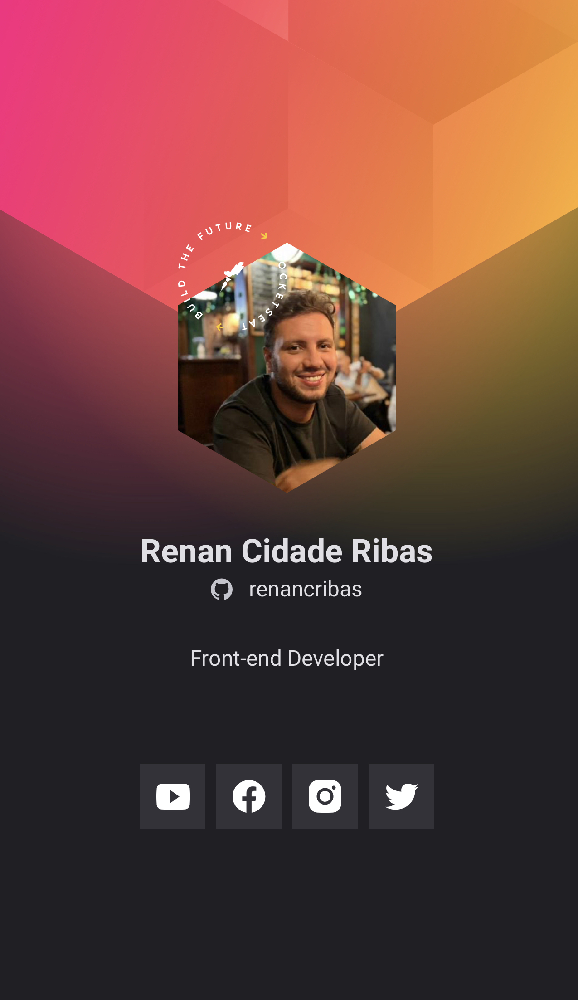

<h1 align="center">
  Crachá Virtual criado na trilha origin da Rocketseat.
</h1>

  <a href="#-tecnologias">Tecnologias</a>&nbsp;&nbsp;&nbsp;|&nbsp;&nbsp;&nbsp;
  <a href="#-projeto">Projeto</a>&nbsp;&nbsp;&nbsp;|&nbsp;&nbsp;&nbsp;
  <a href="#-layout">Layout</a>

 

  

## 🚀 Tecnologias

Esse projeto foi desenvolvido com as seguintes tecnologias:

- HTML
- CSS
- JavaScript

## 💻 Projeto

O Crachá virtual DoWhile é uma aplicação estatica com o objetivo de mostrar as informações do usuário trazidas do GitHub API e inseri-lás em um layout com a cara do evento DoWhile 2021

## 🔖 Layout

Você pode visualizar o layout do projeto através [desse link](https://www.figma.com/file/9Z2vxc8VTRuZpYjFalCMAl/Badge-Do-While2021-(Copy)?node-id=0%3A1).
